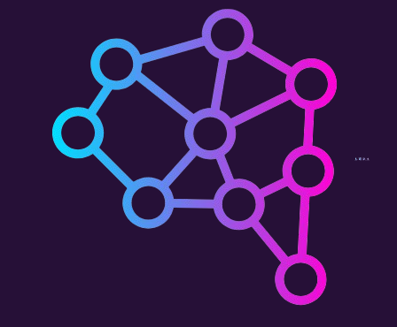

# CodeSage 🧙‍♂️

<div align="center">
  
  <p><em>Your AI-powered Development Pod</em></p>
</div>

## 🌟 Overview

CodeSage is an intelligent coding assistant that helps developers write, review, and improve their code. With an intuitive chat interface and powerful AI capabilities, CodeSage makes programming more efficient and enjoyable.

## ✨ Features

- 💬 **Interactive Chat Interface**: Natural conversation with AI about your code
- 🎨 **Modern UI Design**: Clean, responsive interface with glass-effect components
- 🔄 **Real-time Responses**: Instant AI feedback and code suggestions
- 📝 **Code Analysis**: Get explanations and improvements for your code
- 🎯 **Context-Aware**: Understands your project structure and coding patterns

## 🚀 Getting Started

### Prerequisites

- Node.js (v14.0.0 or higher)
- npm or yarn

### Installation

1. Clone the repository:
```bash
git clone https://github.com/yourusername/codesage.git
cd codesage
```

2. Install dependencies:
```bash
npm install
# or
yarn install
```

3. Start the development server:
```bash
npm run dev
# or
yarn dev
```

## 🖥️ Usage

1. Launch the application in your browser
2. Type your coding-related questions in the chat interface
3. Get instant AI-powered responses and code suggestions
4. Use the various features to improve your coding workflow

## 🛠️ Tech Stack

- **Frontend**: React, TypeScript
- **Styling**: TailwindCSS
- **Icons**: Lucide React
- **UI Components**: Custom glass-effect design

## 📁 Project Structure

```plaintext
codesage/
server/
│── node_modules/        (auto-created after running npm install)
│── index.js            (Main backend file)
│── package.json         (Dependencies and scripts)
│── .env                 (For API keys or sensitive data)
│── routes/
│    ├── chatRoutes.js   (Handles chat requests)
│── controllers/
│    ├── chatController.js (Processes AI responses)
│── config/
│    ├── openaiConfig.js (OpenAI setup)
├── src/
│   ├── assets/
│   ├── components/
│   ├── types/
│   └── ...
├── public/
└── ...
```

## 🤝 Contributing

Contributions are welcome! Please feel free to submit a Pull Request.

1. Fork the project
2. Create your feature branch (`git checkout -b feature/AmazingFeature`)
3. Commit your changes (`git commit -m 'Add some AmazingFeature'`)
4. Push to the branch (`git push origin feature/AmazingFeature`)
5. Open a Pull Request

## 📄 License

This project is licensed under the MIT License - see the [LICENSE](LICENSE) file for details.

## 🙏 Acknowledgments

- Thanks to all contributors who have helped shape CodeSage
- Special thanks to the open-source community

---

<div align="center">
  Made with ❤️ by CodeSage
</div> 
